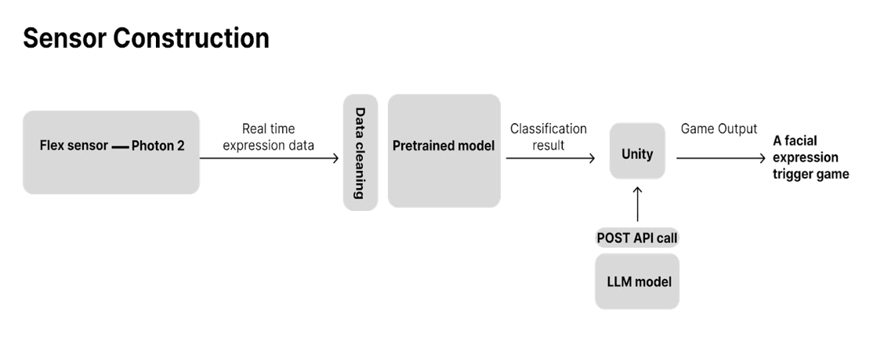
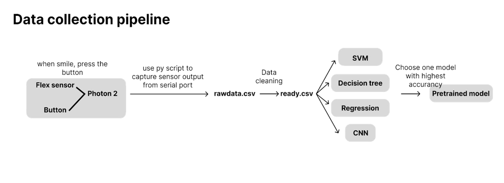
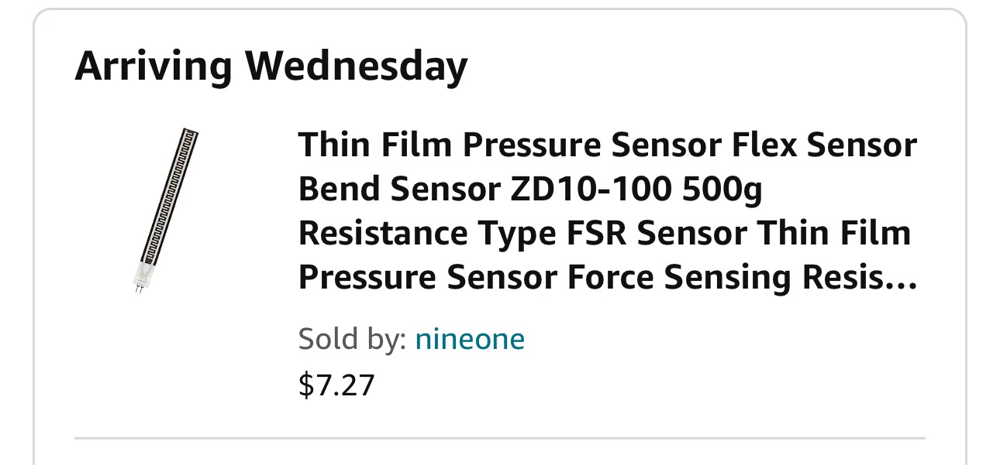
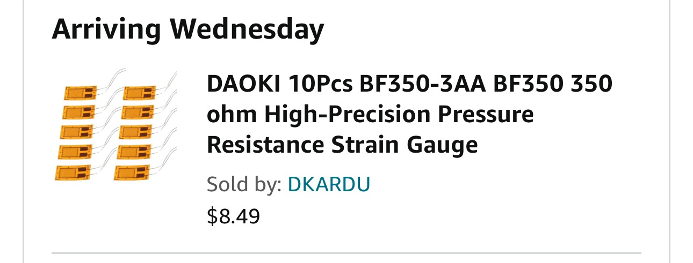
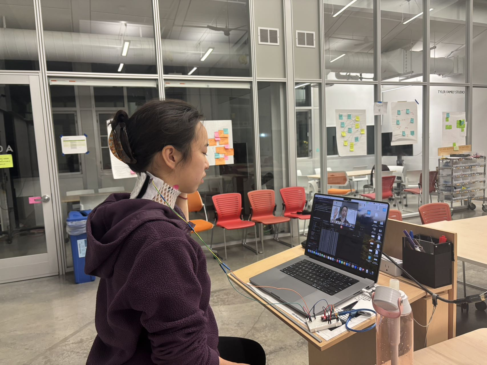
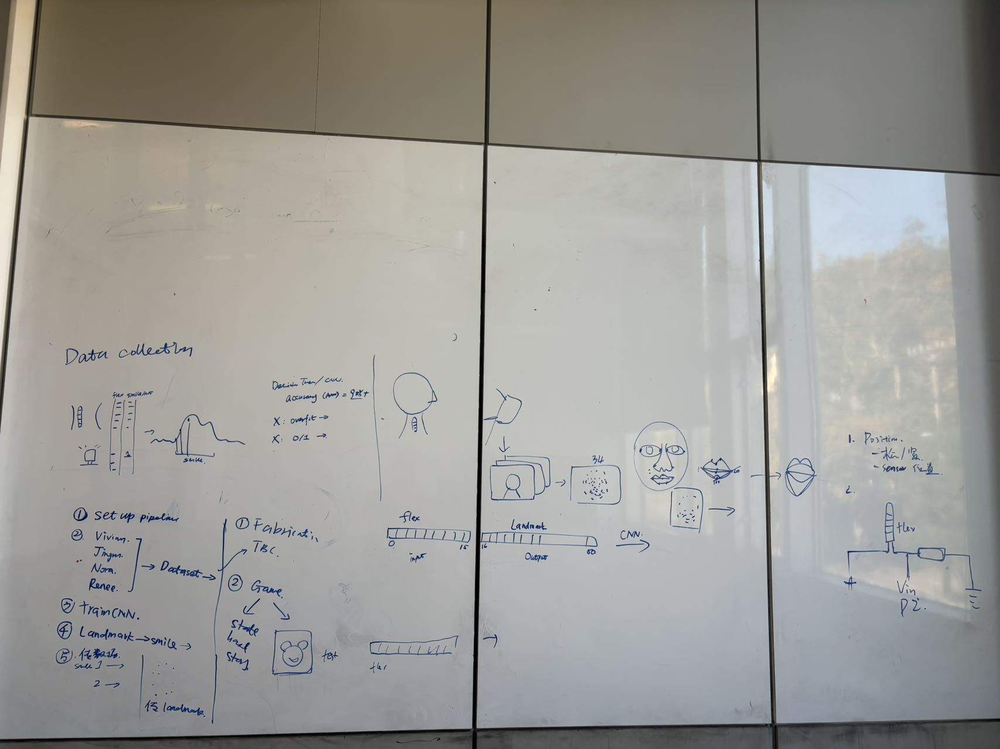
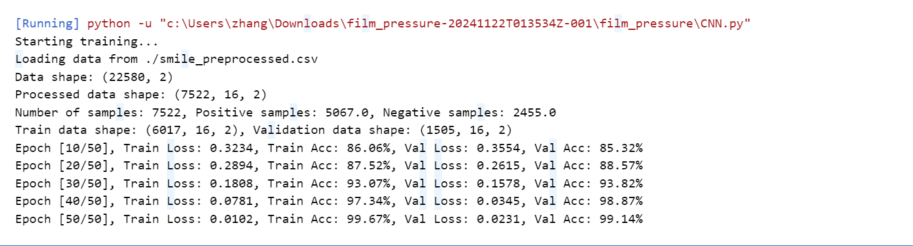

# Week 12: Report 12 #
## Week of 11/14-11/21
### 1. Reflections

During the first week of the FaceStory project, our team focused on establishing the foundational components necessary for developing a medical rehabilitation product aimed at patients with facial movement loss due to neurological conditions. A significant portion of our efforts was dedicated to data collection and sensor integration. The following two diagrams show the comprehensive structure and workflow of the our project "FaceStory". The System Architecture Diagram depicts how the neck-mounted wearable device, equipped with flex sensors and the Photon 2 microcontroller, integrates with machine learning models and the Unity-based interactive game interface, including the ChatGPT API for adaptive storytelling. Meanwhile, the Process Diagram outlines the flow of data from sensor input and data cleaning through the CNN model for accurate expression detection, culminating in real-time user feedback via a digital twin in Unity. Together, these diagrams illustrate the seamless interaction between hardware and software components that enable an effective and engaging facial rehabilitation experience.

We began by procuring various flex sensors from Amazon, experimenting with different lengths and structures to identify the most effective options for our application. This experimentation included testing multiple sensor placement methods on the neck—both vertically and horizontally—to determine which configuration best captures the subtle muscle movements associated with facial expressions. Using the Photon 2 microcontroller, we successfully integrated these sensors, allowing us to collect extensive datasets that accurately reflect muscle activity during different facial expressions.

The two pictures above show the different flex sensors we have tried.
 

This picture shows our data collection platform
 

To ensure the reliability of our data, we employed Python for thorough data cleaning, removing any noise and inconsistencies that could impede model accuracy. With the cleaned data, we trained a Convolutional Neural Network (CNN) model, achieving an impressive accuracy rate of 99.14% in detecting and classifying facial expressions. This high level of accuracy validated our sensor setup and data processing pipeline, demonstrating the potential effectiveness of our machine learning approach in real-time expression detection.

This picture shows the process of discussing about the data colllection and processing
 

This picture shows the result of our CNN Model
 

Additionally, we developed a comprehensive system architecture diagram to visualize the interaction between the wearable device, machine learning algorithms, and the Unity-based game interface. This diagram was instrumental in ensuring that all team members had a clear understanding of the project's overall structure and the flow of data within the system.

Assessing our progress, we successfully integrated the flex sensors with the Photon 2 microcontroller, established reliable data collection methods, and developed a highly accurate CNN model. These achievements set a strong foundation for the subsequent phases of the project, ensuring that our wearable device can effectively monitor and interpret facial muscle movements.

### 2. Speculations

Looking ahead, the FaceStory project holds significant potential for enhancing facial rehabilitation through advanced technology. We plan to further refine our CNN model by exploring additional data augmentation techniques and potentially integrating hybrid machine learning models to surpass our current accuracy levels. Moreover, we aim to investigate more ergonomic sensor placement methods to increase user comfort without compromising data accuracy.

A relevant industry development is the advancement in flexible sensor technology, which can be leveraged to create more comfortable and less intrusive wearable devices. Integrating such sensors could enhance the user experience, making the rehabilitation process more seamless and less burdensome for patients.

Figure 2: Advanced flexible sensors enhancing wearable device comfort and functionality.

Furthermore, the data collected during this initial phase will inform our future development strategies, allowing us to tailor the wearable device to better meet the needs of our users. By continuously iterating on our design and incorporating user feedback, we can ensure that FaceStory remains both effective and user-friendly.

