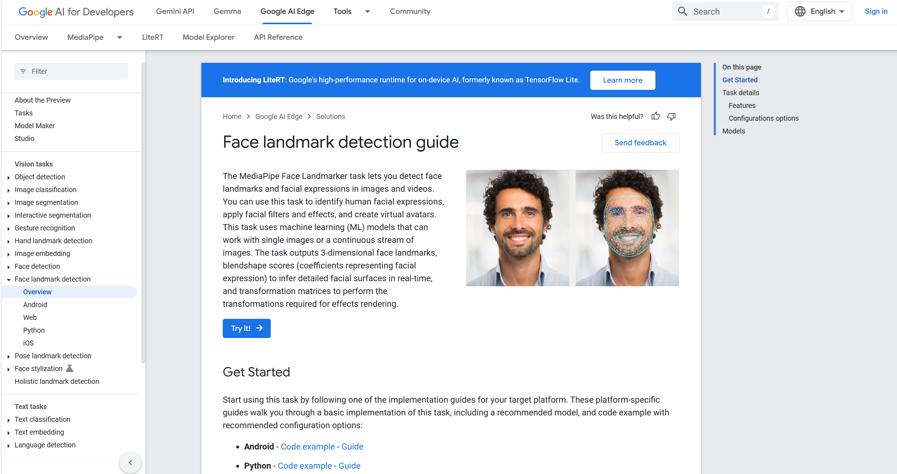
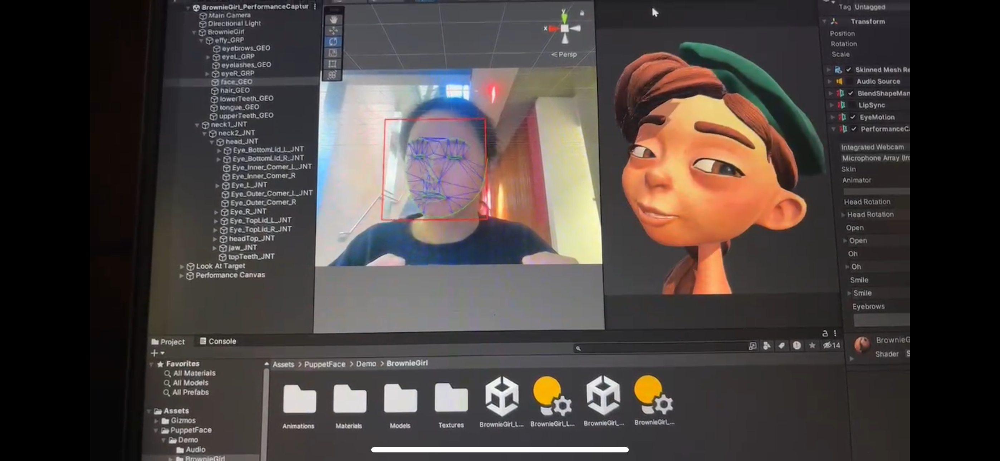
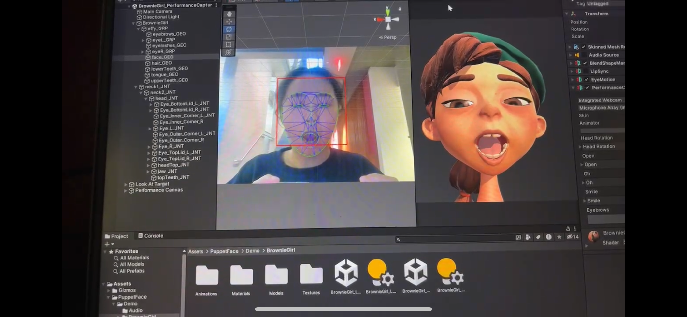

# Final Week: Report 13 #
## Week of 12/02-12/05
### 1. Reflections
In this week, our focus transitioned to integrating the machine learning models with the Unity interface and exploring advanced features to enhance the user experience. A significant portion of our efforts was dedicated to implementing Google’s Face Landmark Detection as a tool to reconstruct a digital twin of the user. This involved connecting the facial expression data from our highly accurate CNN model with Unity to create an animated character that mirrors the user’s expressions in real-time.

This picture shows the API of Google Face Landmark we use
 
By leveraging Google’s Face Landmark Detection, we accurately mapped facial landmarks and translated them into corresponding animations within Unity. This integration enables the digital twin to replicate the user’s facial expressions in real time, providing immediate visual feedback and making the rehabilitation process more engaging and interactive. The following two images showcase our Unity interface: when the user displays certain facial expressions, the digital twin responds accordingly, delivering real-time feedback to enhance the user’s experience.

In addition to these advancements, we also considered the holistic flow of data and interaction within the system. The following diagram captures the end-to-end process—beginning with the user’s facial expression, moving through the sensors and microcontroller, and culminating in classification and feedback within Unity. In essence, the diagram shows how a user’s muscle movements are first detected by the neck-mounted flex sensors, then transmitted to the Photon microcontroller, which forwards the output to the pre-trained model for expression classification. This classification result is relayed to Unity, where an animated digital twin or scenario element is triggered, delivering immediate, intuitive feedback to the user and supporting a more immersive rehabilitation experience.

Additionally, we integrated the ChatGPT API into Unity to develop an adaptive storytelling feature. This feature generates dynamic narratives that guide users through their rehabilitation exercises, making the experience more enjoyable and motivating. By leveraging ChatGPT, the system can create personalized storylines that adapt based on the user’s progress and interactions, ensuring that the rehabilitation process remains both effective and engaging.

Despite these advancements, we encountered challenges in fine-tuning the digital twin’s responsiveness and ensuring that the storytelling narratives remain contextually relevant and engaging. These issues highlighted the need for ongoing refinement and user feedback to optimize both the digital twin and the interactive storytelling components.  

### 2. Speculations

Future developments for FaceStory include enhancing the digital twin’s realism and responsiveness by integrating more advanced facial landmark detection algorithms and refining animation parameters within Unity. Such improvements will make the facial cues more natural, ultimately creating a more immersive rehabilitation experience. Additionally, we plan to broaden the scope of our storytelling capabilities by introducing a richer variety of narratives and adaptive difficulty levels, ensuring each user’s exercises evolve as they progress.

A notable industry example that supports the value of such digital interventions is the success of mental health digital therapeutics at Froedtert & the Medical College of Wisconsin. As reported by Bill Siwicki in Healthcare IT News(https://www.healthcareitnews.com/news/mental-health-digital-therapeutics-boost-outcomes-froedtert-mcw), evidence-based digital tools have helped patients manage a range of conditions—from anxiety and depression to insomnia—improving both user satisfaction and clinical outcomes.

Inspired by these successes in mental health contexts, we intend to integrate real-time user feedback mechanisms in FaceStory. Incorporating additional sensors and refining our machine learning models will enable the system to adjust difficulty and engagement dynamically, ensuring that rehabilitation exercises remain appropriately challenging, motivating, and user-friendly. By continuously iterating on design and adopting cutting-edge technologies, FaceStory strives to revolutionize facial rehabilitation—making it more accessible, efficient, and ultimately more beneficial to patients’ overall quality of life.
