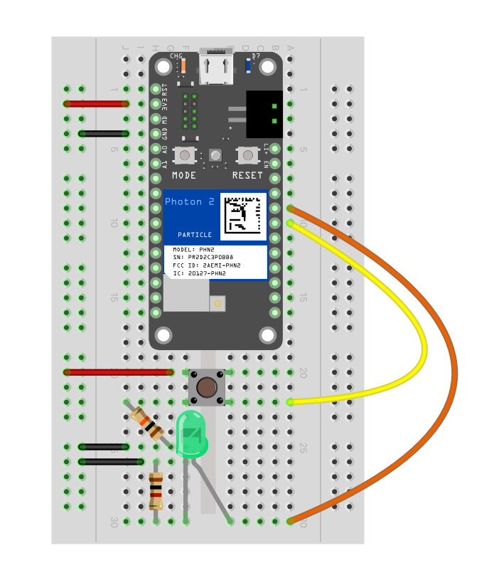

# Week 5: Report 5 #
## Week of 09/26-10/03
### 1. Reflections

It was my first experience working with the Photon 2 IoT system, and it required both quick learning and considerable effort to achieve a high-quality outcome. I didn’t just follow the provided instructions—I took extra steps to enhance both the hardware and software components. Here is a detailed breakdown of my contributions and improvements:

1. **Simplified Circuit Design:**  
   After analyzing the original circuit, I quickly identified ways to make the design more streamlined and efficient. By simplifying the circuit, I was able to reduce complexity and potential points of failure, significantly improving the overall functionality of the hardware. The following two diagrams shows how I simplify the circuit design.
   
   
   

2. **Button Replacement and Knowledge Sharing:**  
   I took the initiative to study the mechanics of different types of buttons. By replacing the 4-leg button with a more efficient 2-leg button, I enhanced the hardware design. Furthermore, I didn’t stop there—I shared this newfound knowledge with classmates, teaching them how to make similar improvements to their projects.

   
   
   The above diagram shows clearly the circuit of 4-leg button. I use this to understand how it works, and find a way to use 2-leg button to replace it.

3. **Code Optimization and Debugging:**  
   Instead of simply copying the provided code, I invested time in understanding how it worked and identifying areas for improvement. I added a serial print function to the code, which made debugging much more efficient and effective. This enhancement helped me quickly resolve issues during testing and contributed to the overall success of the project.
   
   
   
   
   The above screenshots show how I use serial function to check whether my serial printer is working and whether the device detect it when I press the button. 

Now I'm going to present the some images and videos for my three projects.

   

#### 1.1 button_led_pulse

   The following pictures show how I make the circuit more simple. And I tested the system with both green LED and red LED.
   **You can press [here](https://youtube.com/shorts/PtWXePgDtTs?feature=share) to watch the full video.**
   
   
   
   
   

#### 1.2 fsr_to_ledcolor

   In this project, I first learned how RGB LED works. Then I designed the circuit, uploading the code and successfully run it! The color is changing! So beautiful!
   **You can press [here](https://youtube.com/shorts/fe86Xr1i_4M?feature=share) to watch the full video.**
      
   
   
   
   

#### 1.3 basic_button_soc

   The following picture shows how my circuit looks like and the related information from serial printer. When I pressed the button, the system can detect it and gave me feedback with serial monitor.
   **You can press [here](https://youtube.com/shorts/Cfe_3X23axM?feature=share) to watch the full video.**
      
   

#### short summary

I am proud of how quickly I was able to learn the necessary concepts and apply them in a meaningful way, going beyond just following instructions. However, the most significant challenge I faced was setting up the Photon 2 board, which was time-consuming due to unclear guidance and complex configurations. Despite difficulties related to the kit, VS Code, version compatibility, and IoT network connection, I remained focused and resolved these issues. Ultimately, my persistence and quick learning allowed me to successfully complete all tasks while improving both the code and hardware design.

This experience has significantly deepened my understanding of IoT systems and their components, particularly in relation to hardware-software integration and debugging.

### 2. Speculations
Looking ahead, I plan to further enhance my understanding of the Photon 2 IoT system by exploring more advanced features such as sensor integration and cloud-based data logging. One direction I foresee for future projects is leveraging real-time data analytics from the sensors connected to the system, which could be crucial for expanding into more complex IoT applications. Additionally, I would like to explore more efficient ways to configure the Photon 2 board and streamline the setup process to save time for myself and others. For instance, automating the network connection steps could reduce the effort required for IoT deployment. Another area of interest involves delving deeper into version management within VS Code and ensuring compatibility with the Photon 2 system. I also see value in creating tutorials or reference guides to help classmates and other learners overcome common challenges, such as configuration and debugging, which I experienced firsthand. 
