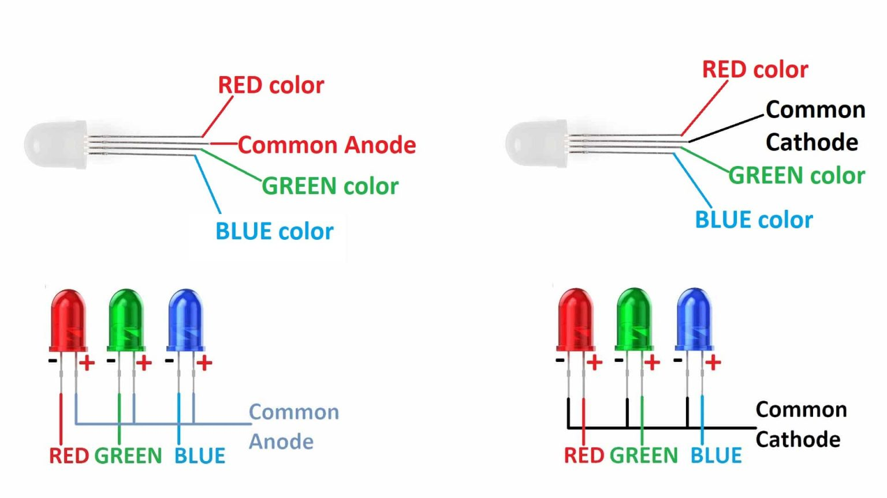

# Week 6: Report 6 #
## Week of 10/3-10/10
### 1. Reflections

It was my first experience working with the Photon 2 and Stemma QT. I didn’t just follow the provided instructions—I took extra steps to enhance both the hardware and software components. Here is a detailed breakdown of my contributions and improvements:

#### 1.1 MPU 6070

How I improve and try new functions? The main idea is controling the brightness of an LED connected to A5 based on the absolute value of the ay (acceleration on the Y-axis) from the MPU6050 sensor. To achieve this, I conducted following steps.

·  Limit the ay values to a range (-15000 to 15000) using constrain().
·  Map the absolute value of ay to a range suitable for PWM control (0 to 255). Since the analogWrite() function expects values between 0 (LED off) and 255 (maximum brightness), I map the constrained ay values to this range.
·  Smooth out the sensor values using a simple rolling average or a moving average to reduce noise.
·  Control the brightness of the LED on A5 using analogWrite() based on the mapped value from the sensor.
   **You can press [here](https://youtube.com/shorts/PtWXePgDtTs?feature=share) to watch the full video.**
   
   
   
   
   

#### 1.2 fsr_to_ledcolor

   In this project, I first learned how RGB LED works. Then I designed the circuit, uploading the code and successfully run it! The color is changing! So beautiful!
   **You can press [here](https://youtube.com/shorts/fe86Xr1i_4M?feature=share) to watch the full video.**
      
   
   
   
   

#### 1.3 basic_button_soc

   The following picture shows how my circuit looks like and the related information from serial printer. When I pressed the button, the system can detect it and gave me feedback with serial monitor.
   **You can press [here](https://youtube.com/shorts/Cfe_3X23axM?feature=share) to watch the full video.**
      
   

#### short summary

I am proud of how quickly I was able to learn the necessary concepts and apply them in a meaningful way, going beyond just following instructions. However, the most significant challenge I faced was setting up the Photon 2 board, which was time-consuming due to unclear guidance and complex configurations. Despite difficulties related to the kit, VS Code, version compatibility, and IoT network connection, I remained focused and resolved these issues. Ultimately, my persistence and quick learning allowed me to successfully complete all tasks while improving both the code and hardware design.

This experience has significantly deepened my understanding of IoT systems and their components, particularly in relation to hardware-software integration and debugging.

### 2. Speculations
Looking ahead, I plan to further enhance my understanding of the Photon 2 IoT system by exploring more advanced features such as sensor integration and cloud-based data logging. One direction I foresee for future projects is leveraging real-time data analytics from the sensors connected to the system, which could be crucial for expanding into more complex IoT applications. Additionally, I would like to explore more efficient ways to configure the Photon 2 board and streamline the setup process to save time for myself and others. For instance, automating the network connection steps could reduce the effort required for IoT deployment. Another area of interest involves delving deeper into version management within VS Code and ensuring compatibility with the Photon 2 system. I also see value in creating tutorials or reference guides to help classmates and other learners overcome common challenges, such as configuration and debugging, which I experienced firsthand. 
